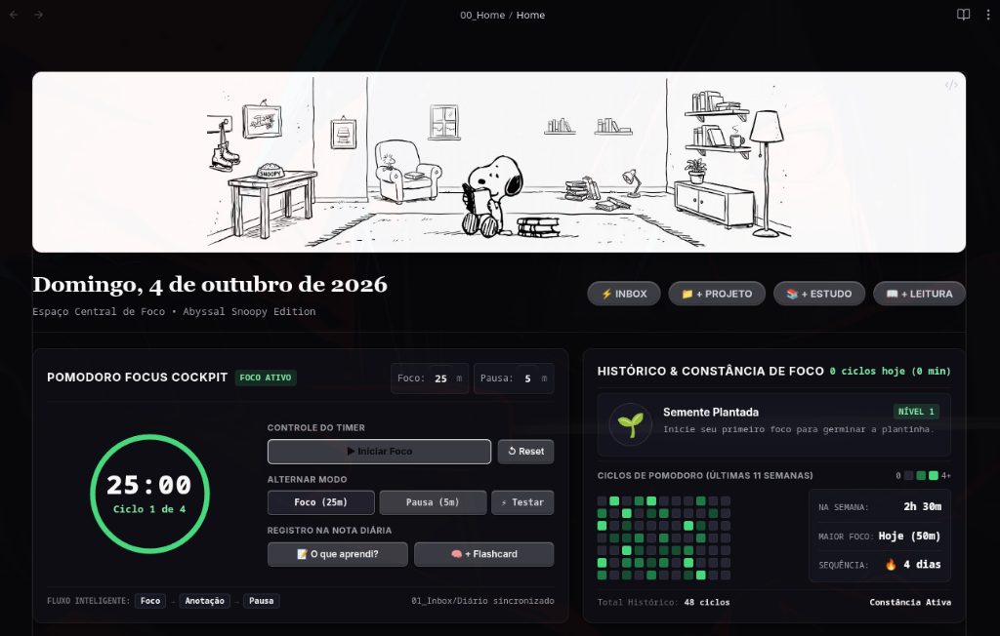
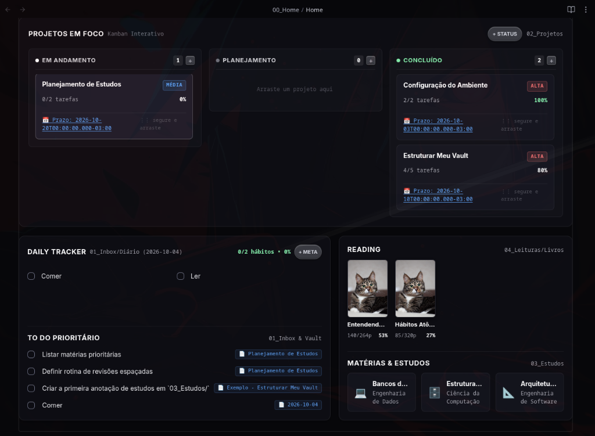

<div align="center">

# 🐶 Snoopy Vault • Abyssal Edition

Painel de controle minimalista, cockpit de foco e gestão de conhecimento pessoal para **Obsidian**.

[](https://obsidian.md)
[](https://github.com/blacksmithgu/obsidian-dataview)
[](.obsidian/snippets/05_Abyssal_Snoopy.css)
[](LICENSE)

<br/>

<p align="center">
  
</p>

<p align="center">
  
</p>

</div>

---

## Por que o Snoopy Vault?
A maioria dos cofres no Obsidian oscila entre dois extremos pouco práticos:

1. **Over-engineering excessivo:** Dezenas de plugins concorrentes, dezenas de pastas vazias e telas lentas que desestimulam o registro diário de anotações.
2. **Markdown cru sem visibilidade:** Notas fragmentadas sem uma central de comando que ofereça clareza sobre o foco do dia, progresso de projetos ou ritmo de estudos.

O **Snoopy Vault** equilibra estética, foco e simplicidade: uma **página inicial única e viva** (em DataviewJS puro) integrada a um tema escuro de alto contraste (*Abyssal #070709*). O ambiente unifica temporizador de foco, evolução botânica de constância, Kanban interativo de projetos e rastreador de hábitos sem depender de serviços externos.

---

## O que ele entrega

- **🍅 Pomodoro Focus Cockpit:** Temporizador circular flat em SVG (170px) com alternância fluida entre Foco e Pausa, ajuste direto de minutos e fluxo inteligente em 3 etapas (*Foco → Anotação → Pausa Automática*), sincronizando minutos líquidos com o histórico de estudos.
- **📝 Captura Ágil & Flashcards:** Ao término de cada foco (ou via botões de 1-clique), consolide o aprendizado e crie flashcards (`::`) automaticamente na nota diária (`01_Inbox/Diário/AAAA-MM-DD.md`).
- **🌱 Histórico & Jardim Botânico:** Acompanhe a constância com um avatar que germina e evolui (de *Semente* a *Árvore*) conforme os ciclos do dia são concluídos, além de mapa de calor de 11 semanas com estatísticas de pico e sequência.
- **📋 Kanban Multi-Escopo & Controle Tátil Mobile:** Quadro visual com suporte a Projetos e Estudos, controle tátil com botão `⋮` para telas sensíveis ao toque (Obsidian Mobile via Git), cálculo dinâmico de progresso e detecção de tarefas atrasadas.
- **✅ Central de Tarefas Relacional (To-Do ↔ Kanban):** Gestão de tarefas com abas de prazo (*Hoje*, *Próximas*, *Todas*), suporte à sintaxe do plugin *Tasks* (`📅` e `⏫`), seletor híbrido de iniciativa (gravação direta no projeto ou no diário) e badges clicáveis de escopo.
- **📚 Framework de Estudos (Estilo Estudei):** Subdashboard sob demanda com 4 abas especializadas: Painel de Controle (Donut SVG por matéria e Gráfico de Linha/Área SVG dos últimos 7 dias sincronizado com o Pomodoro), Meu Planner semanal de blocos, Central de Revisões Espaçadas (1d ➔ 7d ➔ 14d ➔ 30d) e Ciclo Contínuo de Disciplinas.
- **📖 Bookshelf (Estilo KOReader):** Subdashboard de leituras inspirado no plugin Bookshelf do KOReader, com Hero Card superior em 3D, sinopse editorial, abas de e-reader (*Home*, *Recent*, *Quero Ler*, *Favourites*), Shelf Grid com marcadores de fita (*ribbons*) e busca online instantânea via Open Library API sem necessidade de pacotes locais.

---

## Estrutura do Repositório

```text
Snoopy_Vault/
├── 00_Home/                 # Painel central de navegação e foco
│   └── Home.md              # Dashboard vivo em DataviewJS (Hub central)
├── 01_Inbox/                # Entrada rápida e notas diárias
│   └── Diário/              # Notas diárias (AAAA-MM-DD.md)
├── 02_Projetos/             # Projetos ativos gerenciados pelo Kanban
├── 03_Estudos/              # Matérias, cursos e anotações acadêmicas
│   └── Painel de Estudos.md # Subdashboard especializado (Ciclo & Questões)
├── 04_Leituras/             # Gestão de referências
│   └── Livros/              # Fichas de leitura com capas e progresso
├── 05_Arquivo/              # Projetos e notas finalizados
├── 99_Meta/                 # Metadados e código modular do ecossistema
│   ├── Attachments/         # Capas, banners e capturas de tela
│   ├── Snoopy/              # Módulos independentes e orquestrador
│   │   ├── home/view.js     # Orquestrador do Home
│   │   ├── modulos/         # 01 a 05 (Banner, Pomodoro, Kanban, To-Do, Leituras)
│   │   └── subdashboards/   # Subdashboards sob demanda (Estudos, etc.)
│   ├── Templates/           # Modelos de notas (Projeto, Estudo, Livro, Diário, Inbox)
│   ├── kanban-columns.json  # Configuração de status dinâmicos do Kanban
│   └── ⚙️ Configurações.md  # Painel de preferências visuais e tempos de foco
├── .obsidian/               # Configuração do cofre
│   ├── snippets/            # 05_Abyssal_Snoopy.css (Design System)
│   ├── community-plugins.json # Plugins ativos
│   └── themes/              # Tema base Border
├── LICENSE                  # Licença MIT
└── README.md                # Este documento
```

---

## Instalação e Uso Rápido

Como o repositório já inclui os snippets de estilo e os plugins configurados, começar é imediato:

### 1. Clonar ou Baixar o Repositório
```bash
git clone https://github.com/Arkmedess/Snoopy_Vault.git
```

### 2. Abrir no Obsidian
1. Abra o aplicativo Obsidian.
2. Na janela de cofres, clique em **"Abrir pasta como cofre"** (*Open folder as vault*).
3. Selecione a pasta clonada `Snoopy_Vault`.

### 3. Ativar Plugins Comunitários
1. Ao abrir pela primeira vez, vá em **Configurações > Plugins da comunidade**.
2. Clique em **"Ativar plugins da comunidade"** (*Turn on community plugins*).
3. Certifique-se de que o **Dataview** está habilitado e com a opção *Enable JavaScript Queries* ligada.

### 4. Pronto!
Abra a nota [`00_Home/Home.md`](00_Home/Home.md) para interagir com o dashboard completo.

---

## Plugins Utilizados

| Plugin | Finalidade no Cofre |
| :--- | :--- |
| **Dataview** | Motor central do dashboard reativo, Pomodoro e consultas de tarefas |
| **Obsidian Git** | Versionamento e backup automático direto no GitHub |
| **Tasks** | Gestão de tarefas, checkboxes e filtragem por status |
| **Spaced Repetition** | Sistema de repetição espaçada para revisar flashcards gerados nos focos |
| **Omnisearch** | Busca semântica rápida por arquivos e anotações |
| **Advanced Slides** | Criação de apresentações a partir de notas markdown |

---

## Design System & Estilo

O tema [`05_Abyssal_Snoopy.css`](.obsidian/snippets/05_Abyssal_Snoopy.css) adota uma paleta cinematográfica escura:
* **Fundo Profundo:** `#070709` (Preto puro confortável para sessões prolongadas)
* **Superfícies & Cartões:** `#0d0d12` e `#121218` com bordas sutis em `rgba(255, 255, 255, 0.08)`
* **Acentos de Foco & Sucesso:** `#4ade80` e `#86efac`
* **Acentos de Pausa & Prazos:** `#60a5fa` e `#93c5fd`
* **Botões & Tipografia:** Texto travado em branco permanente (`#ffffff`), com hover protegido contra contraste invisível.

---

## Licença

Distribuído sob a licença [MIT](LICENSE).
